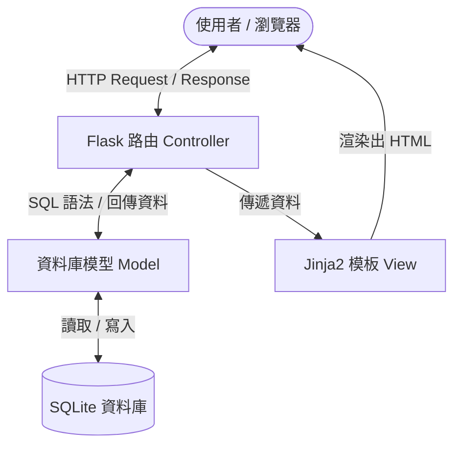

# 系統架構設計 (Architecture) - 讀書筆記本

## 1. 技術架構說明

本專案採用輕量級的 Web 開發技術棧，適合快速開發與概念驗證，並符合學生個人使用的需求。不採用前後端分離架構，而是由後端直接渲染 HTML 頁面。

- **後端框架：Python + Flask**
  - **原因**：Flask 是輕量級的微框架，學習曲線平緩，非常適合用來建立小型的讀書筆記本系統，且擴充性高。
- **前端模板：Jinja2 + 基礎 CSS**
  - **原因**：Jinja2 是 Flask 內建的強大模板引擎，可以無縫整合後端資料與前端 HTML。我們不需要複雜的前端框架（如 React/Vue），用原生的 HTML/CSS 搭配 Jinja2 即可滿足需求。
- **資料庫：SQLite**
  - **原因**：SQLite 是輕量級的關聯式資料庫，資料儲存在單一檔案中，不需要額外安裝與設定資料庫伺服器，非常適合本專案的本地端應用情境。

### Flask MVC 模式說明
雖然 Flask 本身沒有嚴格規定 MVC（Model-View-Controller）架構，但我們在專案中會採用類似的設計模式：
- **Model（模型）**：負責與 SQLite 資料庫互動，定義資料結構（如：書籍表、筆記表），並處理資料的讀取與寫入。
- **View（視圖）**：即 Jinja2 模板，負責接收來自 Controller 的資料，並將其渲染成使用者在瀏覽器中看到的 HTML 頁面。
- **Controller（控制器）**：即 Flask 的路由（Routes）。負責接收使用者的請求（如：新增書籍、搜尋），處理商業邏輯，向 Model 請求資料，最後將資料傳遞給 View 進行渲染。

## 2. 專案資料夾結構

為了保持程式碼的整潔與可維護性，專案資料夾將依照功能模組進行劃分：

```text
讀書筆記本專案/
├── app/                  # 應用程式主要資料夾
│   ├── models/           # 模型層 (Models)：放置與資料庫互動的 Python 程式碼
│   │   ├── __init__.py
│   │   └── book.py       # 處理書籍、心得、評分相關的資料庫操作
│   ├── routes/           # 控制層 (Controllers/Routes)：放置路由與邏輯
│   │   ├── __init__.py
│   │   └── book_routes.py # 處理書籍相關的 HTTP 請求 (GET/POST)
│   ├── templates/        # 視圖層 (Views)：放置 Jinja2 渲染的 HTML 模板
│   │   ├── base.html     # 共用版型 (標題、導覽列等)
│   │   ├── index.html    # 首頁 (書籍列表與搜尋)
│   │   ├── add.html      # 新增書籍/心得頁面
│   │   ├── edit.html     # 編輯書籍/心得頁面
│   │   └── detail.html   # 單一書籍與心得詳細頁面
│   └── static/           # 靜態資源：放置 CSS, JS, 圖片等
│       └── style.css     # 系統的主要樣式表
├── instance/             # 放置運行時產生的檔案 (應加入 .gitignore)
│   └── database.db       # SQLite 資料庫檔案
├── docs/                 # 文件資料夾
│   ├── PRD.md            # 產品需求文件
│   └── ARCHITECTURE.md   # 系統架構文件 (本文件)
├── app.py                # 應用程式入口：初始化 Flask 與啟動伺服器
└── requirements.txt      # 記錄 Python 依賴套件清單 (如 Flask)
```

## 3. 元件關係圖

以下展示使用者操作時，系統內部元件的資料流向：



**操作流程範例（新增讀書筆記）：**
1. 使用者在瀏覽器填寫書名、心得與評分，點擊「送出」。
2. **Controller (Flask Route)** 收到 POST 請求。
3. Controller 呼叫 **Model** 將資料寫入。
4. **Model** 將資料儲存至 **SQLite 資料庫**，並回傳成功訊息給 Controller。
5. Controller 處理成功後，指示 **View (Jinja2 Template)** 重新渲染首頁（書籍列表）。
6. 渲染後的 HTML 回傳給瀏覽器，使用者看到新增成功的畫面。

## 4. 關鍵設計決策

1. **單一資料庫表設計（適用於 MVP）**：
   為了簡化開發，初期的 MVP 版本可以將「書籍基本資料（書名）」與「閱讀心得（筆記、評分）」合併在同一個 SQLite 資料表中。未來若功能擴充（例如：一本書有多篇筆記），再考慮拆分成關聯表。
2. **使用原生 SQL 或輕量 ORM**：
   考量到學生的學習曲線與專案規模，初期建議使用原生的 `sqlite3` 模組或簡單的 ORM（如 SQLAlchemy 的基礎功能）來進行資料操作，避免過度設計。
3. **基礎 CSS 搭配共用模板 (`base.html`)**：
   利用 Jinja2 的模板繼承（Template Inheritance）功能，將網頁的共同部分（如導覽列、頁尾）抽離到 `base.html` 中，確保整個網站有一致的風格，同時減少重複撰寫 HTML 的時間。
4. **伺服器端渲染 (SSR)**：
   相較於透過 AJAX/API 獲取資料，本系統主要採用伺服器端渲染，也就是在後端組裝好 HTML 後直接回傳給瀏覽器。這樣不僅符合傳統 Web 開發的思維，也降低了前端 JavaScript 的複雜度。
