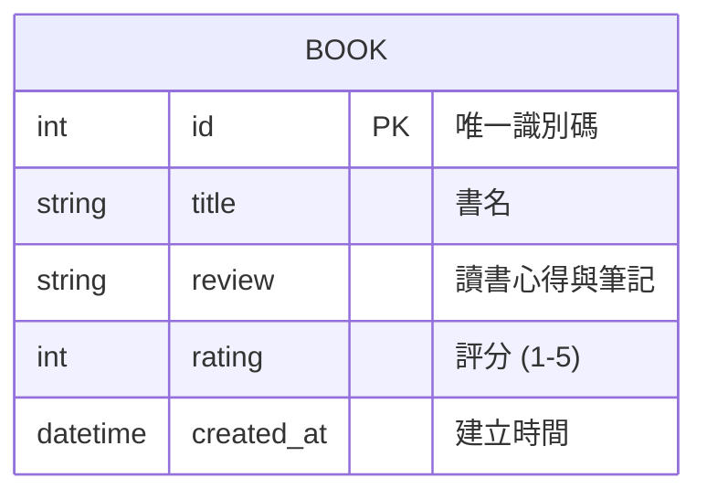

# 資料庫設計 (DB Design) - 讀書筆記本

根據系統需求與架構設計，本專案 MVP 版本採用單一資料表設計，將書籍基本資料與讀書心得、評分合併儲存。

## 1. ER 圖（實體關係圖）

## 2. 資料表詳細說明

### `books` (讀書筆記表)

儲存學生建立的每一本書籍紀錄與對應的心得評分。

| 欄位名稱 | 型別 | 必填 | 說明 |
| -------- | ---- | ---- | ---- |
| `id` | INTEGER | 是 | Primary Key，自動遞增的書籍 ID |
| `title` | TEXT | 是 | 書名，不得為空 |
| `review` | TEXT | 否 | 讀書心得、筆記摘要 |
| `rating` | INTEGER | 否 | 書籍評分，範圍為 1 到 5 的整數 |
| `created_at` | DATETIME | 否 | 紀錄建立的時間，預設為當前系統時間 |

> 備註：MVP 版本暫不處理多個使用者 (User) 或多篇筆記的關聯，所有資料均紀錄於此單一資料表。

## 3. SQL 建表語法與 Model

- SQL 建表語法已儲存於 `database/schema.sql`。
- Python Model 程式碼已儲存於 `app/models/book.py`，使用內建的 `sqlite3` 模組實作 CRUD。
