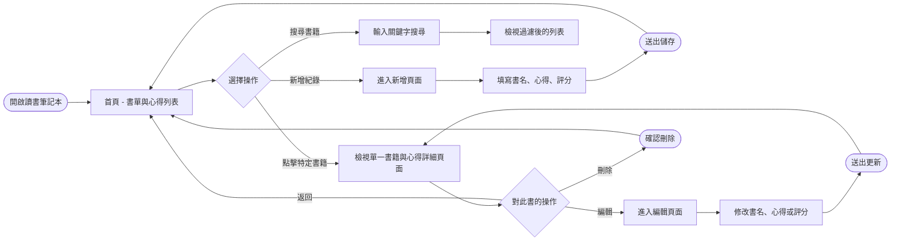
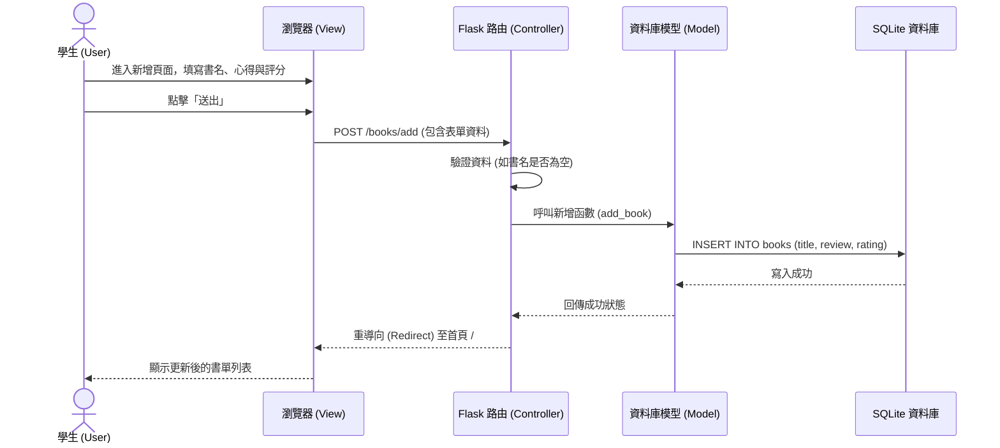

# 流程圖設計 (Flowchart) - 讀書筆記本

本文件包含使用者操作系統時的「使用者流程圖」，以及系統內部元件互動的「系統序列圖」。

## 1. 使用者流程圖 (User Flow)

此流程圖展示了學生進入讀書筆記本後，可以進行的各項操作路徑。

## 2. 系統序列圖 (Sequence Diagram)

此序列圖以「**新增讀書筆記**」為例，展示從前端瀏覽器到後端資料庫的完整互動流程。

## 3. 功能清單與路由對照表

以下為系統核心功能與預計對應的 URL 路徑及 HTTP 方法：

| 功能描述 | URL 路徑 | HTTP 方法 | 說明 |
| -------- | -------- | --------- | ---- |
| 首頁 / 書籍列表 | `/` 或 `/books` | GET | 顯示所有讀書筆記列表，支援透過 GET 參數搜尋 |
| 新增書籍表單頁面 | `/books/add` | GET | 顯示填寫新增書籍與心得的 HTML 表單 |
| 送出新增書籍資料 | `/books/add` | POST | 接收表單資料，寫入資料庫，並重導向至首頁 |
| 檢視書籍詳細頁面 | `/books/<id>` | GET | 根據書籍 ID 顯示該書的詳細內容與心得 |
| 編輯書籍表單頁面 | `/books/<id>/edit` | GET | 顯示包含舊有資料的編輯表單 |
| 送出編輯書籍資料 | `/books/<id>/edit`| POST | 接收修改後的資料，更新資料庫，並重導向至詳細頁面 |
| 刪除書籍紀錄 | `/books/<id>/delete`| POST | 從資料庫刪除指定書籍，並重導向至首頁 |

> 備註：為了安全性，刪除操作應使用 POST 方法而非單純的 GET 連結。
